# Murat Eker | Software Developer

---

## Metrics Dashboard

| **Core Metrics** | **Activity & Insights** |
|:---:|:---:|
|  |  |
|  |  |
|  |  |
|  |  |
|  | |

---

## Automated Updates

This README is automatically updated by GitHub Actions via [`.github/workflows/main.yml`](.github/workflows/main.yml).

**Schedule:** Daily at `01:59 UTC` | Manual trigger via `workflow_dispatch`

**Required Secret:** `METRICS_TOKEN` — a classic PAT with scopes: `public_repo`, `read:user`, `read:org` (add `repo` for private repo data)

*Auto-refreshed daily at 01:59 UTC*
